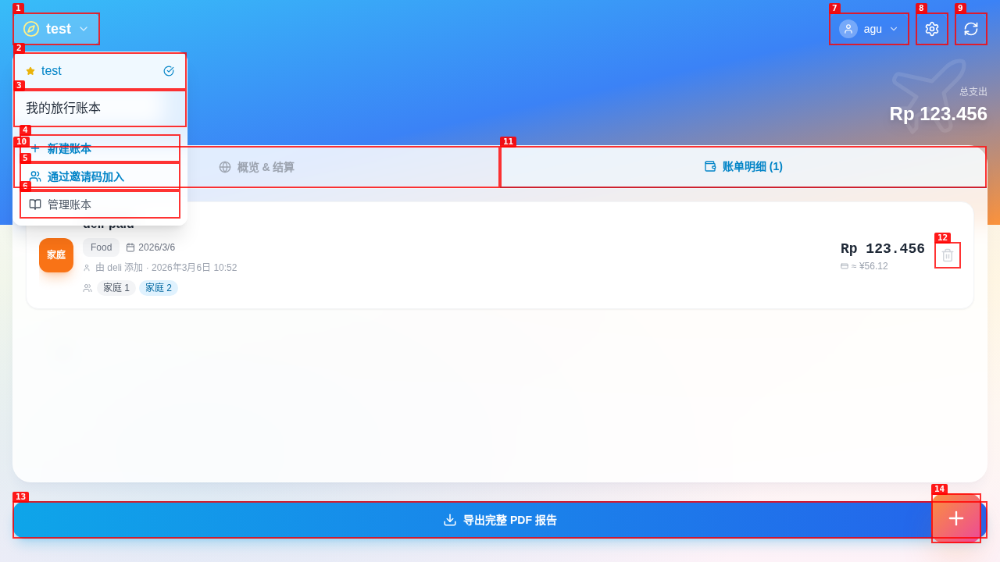
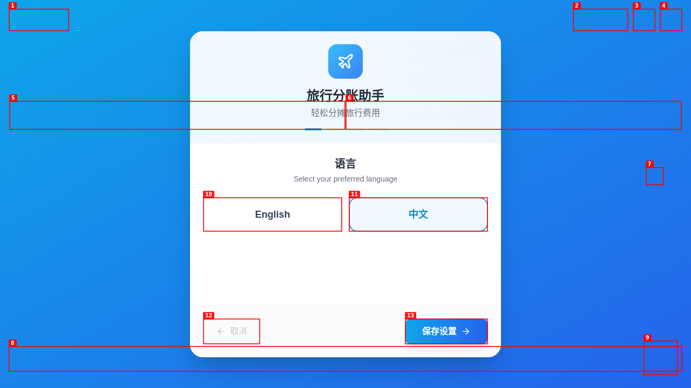
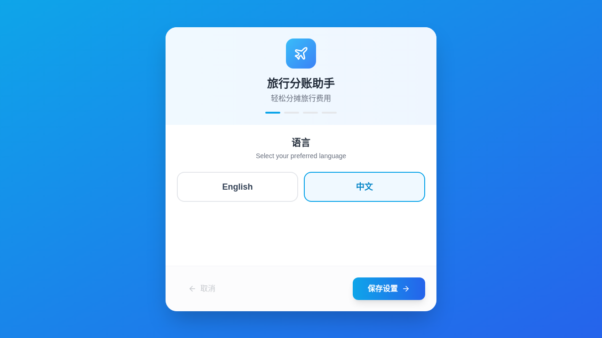
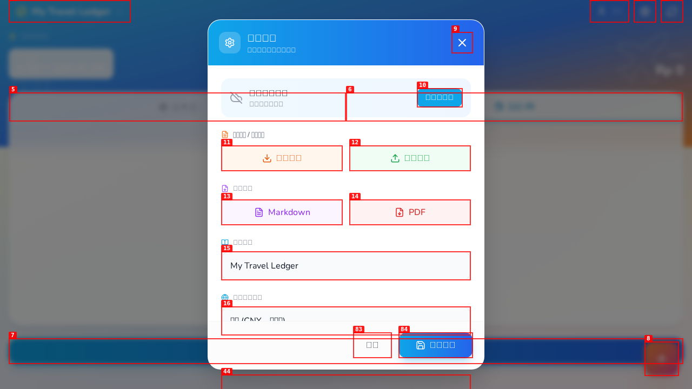

# Dogfood Report: 旅行分账助手 (Travel Finance Helper)

| Field | Value |
|-------|-------|
| **Date** | 2026-03-07 |
| **App URL** | http://localhost:3000 |
| **Session** | travel-finance-helper |
| **Scope** | 登录后的功能验证（使用 agu@test.com / qiaoyunliang123 登录） |

## Summary

| Severity | Count |
|----------|-------|
| Critical | 0 |
| High | 2 |
| Medium | 3 |
| Low | 2 |
| **Total** | **7** |

## Issues

### ISSUE-001: 语言选择对话框无法通过 Escape 键关闭

| Field | Value |
|-------|-------|
| **Severity** | high |
| **Category** | ux |
| **URL** | http://localhost:3000 |
| **Repro Video** | N/A |

**Description**

当打开"新建账本"对话框时，会出现语言选择对话框（English/中文），但是：
1. Escape 键无法关闭该对话框
2. "取消"按钮被禁用（disabled）
3. 用户被迫点击"保存设置"才能关闭对话框

这是一个严重的 UX 问题，用户无法取消操作。

**Repro Steps**

1. 点击账本选择器按钮 "test"
   

2. 点击 "新建账本" 按钮
   

3. **Observe:** 出现语言选择对话框，Escape 键无效，取消按钮被禁用
   

---

### ISSUE-002: 控制台警告 - Chart 组件宽度/高度为 -1

| Field | Value |
|-------|-------|
| **Severity** | high |
| **Category** | console |
| **URL** | http://localhost:3000 |
| **Repro Video** | N/A |

**Description**

页面加载时，控制台出现多次警告：
```
The width(-1) and height(-1) of chart should be greater than 0,
please check the style of container, or the props width(100%) and height(100%),
or add a minWidth(0) or minHeight(undefined) or use aspect(undefined) to control the
height and width.
```

这表明图表组件在渲染时没有正确的尺寸。可能是容器尚未渲染完成就开始绘制图表。

**Repro Steps**

1. 登录应用后查看控制台
2. **Observe:** 出现多次图表宽度/高度警告

---

### ISSUE-003: 控制台警告 - Tailwind CDN 不应用于生产环境

| Field | Value |
|-------|-------|
| **Severity** | medium |
| **Category** | console |
| **URL** | http://localhost:3000 |
| **Repro Video** | N/A |

**Description**

控制台警告：
```
cdn.tailwindcss.com should not be used in production. To use Tailwind CSS in production, install it as a PostCSS plugin or use the Tailwind CLI
```

**Repro Steps**

1. 打开应用
2. 查看控制台
3. **Observe:** 出现 Tailwind CDN 警告

---

### ISSUE-004: 网络错误 - ERR_CONNECTION_CLOSED

| Field | Value |
|-------|-------|
| **Severity** | medium |
| **Category** | console |
| **URL** | http://localhost:3000 |
| **Repro Video** | N/A |

**Description**

控制台出现网络错误：
```
Failed to load resource: net::ERR_CONNECTION_CLOSED
```

这可能是 Vite HMR 连接问题或外部资源加载失败。

**Repro Steps**

1. 打开应用
2. 查看控制台
3. **Observe:** 出现 ERR_CONNECTION_CLOSED 错误

---

### ISSUE-005: Firestore API 弃用警告

| Field | Value |
|-------|-------|
| **Severity** | medium |
| **Category** | console |
| **URL** | http://localhost:3000 |
| **Repro Video** | N/A |

**Description**

控制台警告：
```
@firebase/firestore: Firestore (12.10.0): enableIndexedDbPersistence() will be deprecated in the future, you can use `FirestoreSettings.cache` instead.
```

需要更新 Firestore 配置以使用新的缓存 API。

**Repro Steps**

1. 打开应用
2. 查看控制台
3. **Observe:** 出现 Firestore 弃用警告

---

### ISSUE-006: 设置对话框 UI 布局问题

| Field | Value |
|-------|-------|
| **Severity** | low |
| **Category** | visual |
| **URL** | http://localhost:3000 |
| **Repro Video** | N/A |

**Description**

设置对话框内容较多，可能需要滚动才能看到所有选项。建议优化布局或添加滚动提示。

**Repro Steps**

1. 点击 "设置" 按钮
2. **Observe:** 对话框内容较长
   

---

### ISSUE-007: 按钮点击被覆盖层阻止

| Field | Value |
|-------|-------|
| **Severity** | low |
| **Category** | ux |
| **URL** | http://localhost:3000 |
| **Repro Video** | N/A |

**Description**

在某些情况下，点击按钮会收到 "Element is blocked by another element (likely a modal or overlay)" 错误。可能是模态框背景没有正确关闭或 z-index 问题。

**Repro Steps**

1. 打开登录对话框
2. 尝试点击页面其他按钮
3. **Observe:** 出现 "blocked by another element" 错误

---

## Recommendations

1. **高优先级**: 修复语言选择对话框的 Escape 键关闭功能和取消按钮禁用问题
2. **高优先级**: 修复图表组件在容器未渲染完成时的尺寸问题
3. **中优先级**: 迁移 Tailwind CSS 到 PostCSS 插件方式
4. **中优先级**: 更新 Firestore 配置使用新的缓存 API
5. **中优先级**: 调查 ERR_CONNECTION_CLOSED 错误来源